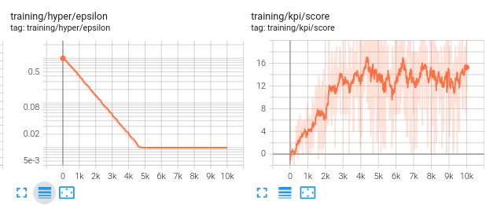

# RL

#### Dependencies

Linux x86-64 system

Install Anaconda python 3, [download](https://repo.anaconda.com/archive/Anaconda3-2021.05-Linux-x86_64.sh)

For setting up the conda environment and download the unity environment run

    bash setup.bash

Make sure to activate the conda environment

    conda activate banana_navigation

#### Environment to solve

actions

  ← ↑ ↓ →

state

     [1.         0.         0.         0.         0.84408134 0.
     0.         1.         0.         0.0748472  0.         1.
     0.         0.         0.25755    1.         0.         0.
     0.         0.74177343 0.         1.         0.         0.
     0.25854847 0.         0.         1.         0.         0.09355672
     0.         1.         0.         0.         0.31969345 0.
     0.]

#### Jupyter Notebook & Tensorboard

In order to analyze/visualize how different choices of hyperparameters effecs the network's (agent's) ability to solve the enviroment, launch the notebook and tensorboard service by running

    bash launch.bash

#### Train the network

Make sure that all dependencies have been installed and that the notbook and tensorboard service have been started.
