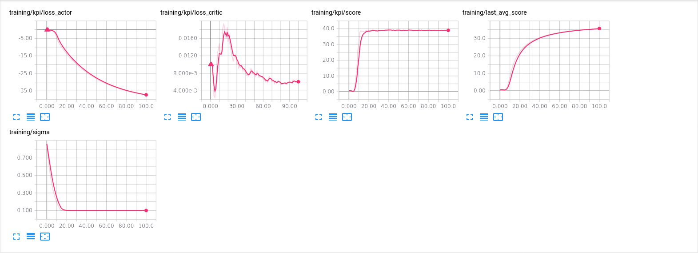

#### Environment to solve

Follow a moving target with 20 double jointed arms.

Keeping the arms within the targets yeilds 20 * 0.04 = 0.8 in reward for each timestep, 0.04 per arm

One episode consists of 1000 timesteps

The action space, per arm, is 4 and corresponds to torque applied to the two joint. The torque can only be
in the inteval [-1, 1]

The states consists of 33 values, per arm, mapping to the position, rotation velocity and angular velocity of the arm

The enviroment can be regarded as solved if the arms get an average total reward of > 30 over 100 episodes.

#### Dependencies

Linux x86-64 system with CUDA Version: 11.2

Install Anaconda python 3, [download](https://repo.anaconda.com/archive/Anaconda3-2021.05-Linux-x86_64.sh)

For setting up the conda environment and download the unity environment run

    bash setup.bash

Make sure to activate the conda environment

    conda activate continuous_control

#### Jupyter Notebook & Tensorboard

In order to analyze/visualize how different choices of hyperparameters effecs the agent's ability to solve the enviroment, launch the notebook and tensorboard service by running

    bash launch.bash

#### Train the agent

Make sure that all dependencies have been installed and that the notebook and tensorboard service have been started. Go into the Continuous_Control notebook and follow the instructions there.

#### Agent description and conclusions

In the report notebook you will find a description of the implemented agent together with conclusions and future work.
